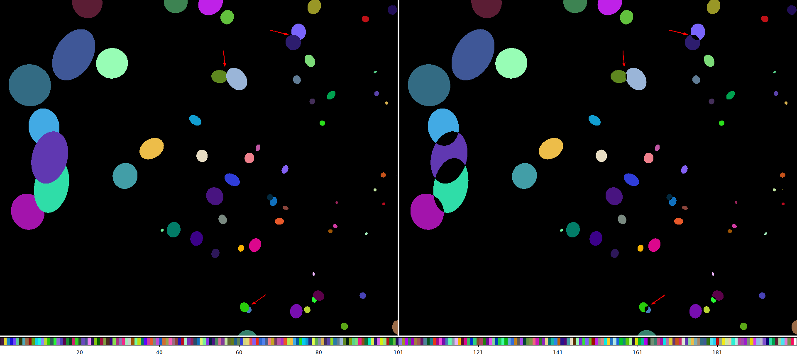

# `rank_roi`

The CIAO [`roi`](https://cxc.cfa.harvard.edu/ciao/ahelp/roi.html) tool 
is used to convert say a source list into a stack of region
files, aka Region Of Interest (not _return on investment_).

The `roi` tool has a lot of options to control things like the 
background region, including the detector edges via the field
of view file, etc.  

When regions overlap it has several `group` options.

- `group=group` creates 1 region file per bundle of sources that overlap.
- `group=individual` creates 1 region file per source and ignores any
overlaps.
- `group=exclude` creates 1 region file per source.  Any overlapping
sources are excluded from each other.

## `group=exclude`

The `exclude` setting is the most common usages of `roi`. This is used
in scripts like `srcflux`.  The complaint with this mode is that
any overlapping source area is never counted given how the region 
logic is implemented.

The problem for `roi` is that it doesn't know how to choose which 
overlapping source the overlapping area should go to.

FAP has determined in the context of CSC2, that the overlapping area
should go to the brightest source.

Enter this script `rank_roi`.  This script takes in a stack of `roi`
regions generated with `group=exclude`, assigns a metric to each 
source region (in this case the number of counts; technically sum of 
pixel values in input image), and modifies the roi files to assign any
overlapping area to the brightest source (highest metric).

## Example

The figure below shows a map ID'ing the source regions created using
`roi` (on the right), and with `rank_roi` applied (on the left).
The colors are random and map to the source ID; black colored pixels 
unassigned to any source.

In the Right frame, the area between overlapping sources is unassigned
(black).  In the Left frame, the source regions have been ranked 
based on the number of counts and the area has been assigned to the
brightest source. 

